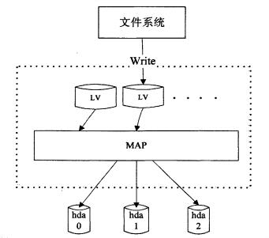

# LVM

LVM，即Logical Volume Manager，逻辑卷管理器，是一种硬盘的虚拟化技术，可以允许用户的硬盘资源进行灵活的调整和动态管理。

LVM是一种可用在Linux内核的逻辑分卷管理器，可用于管理磁盘驱动器或其他类似的大容量存储设备。

## LVM基本组成

LVM利用Linux内核的device-mapper功能来实现存储系统的虚拟化（系统分区独立于底层硬件）。通过LVM，你可用实现存储空间的抽象化，并在上面建立虚拟分区（virtual partitions），可以更简便地扩大和缩小分区，可以增删分区时无需担心某个硬盘上没有足够的连续空间，避免为正在使用的磁盘重新分区的麻烦，为调整分区而不得不移动其他分区的不便。

### LVM的基本组成部分如下

- **物理卷（PV）**

一个可供存储LVM的块设备. 例如: 一块硬盘, 一个MBR或GPT分区, 一个回环文件, 一个被内核映射的设备 (例如 dm-crypt).它包含一个特殊的LVM头。

- **卷组（VG）**

物理卷的一个组，作为存放逻辑卷的容器。 PEs are allocated from a VG for a LV.

- **逻辑卷 (LV)**

"虚拟/逻辑卷"存放在一个卷组中并由物理块组成。是一个类似于物理设备的块设备，例如，你可以直接在它上面创建一个文件系统文件系统。

- **物理块 (PE)**

一个卷组中最小的连续区域(默认为4 MiB)，多个物理块将被分配给一个逻辑卷。你可以把它看成物理卷的一部分，这部分可以被分配给一个逻辑卷。

### LVM原理图如下

## 优点

- 将多块硬盘看作一块大硬盘。
- 使用逻辑卷（LV），可以创建跨越众多硬盘空间的分区。
- 可以创建小的逻辑卷（LV），在空间不足时再动态调整它的大小。
- 在调整逻辑卷（LV）大小时可以不用考虑逻辑卷在硬盘上的位置，不用担心没有可用的连续空间。
- 可以在线（online）对逻辑卷（LV）和卷组（VG）进行创建、删除、调整大小等操作。不过LVM上的文件系统也需要重新调整大小，好在某些文件系统（例如ext4）也支持在线操作。
- 无需重新启动服务，就可以将服务中用到的逻辑卷（LV）在线（online）/动态（live）迁移至别的硬盘上。
- 允许创建快照，可以保存文件系统的备份，同时使服务的下线时间（downtime）降低到最小。
- 支持各种设备映射目标（device-mapper targets），包括透明文件系统加密和缓存常用数据（caching of frequently used data）。这将允许你创建一个包含一个或多个磁盘、并用LUKS加密的系统，使用LVM on top 可轻松地管理和调整这些独立的加密卷 (例如. /, /home, /backup等) 并免去开机时多次输入密钥的麻烦。

## 缺点

- 在系统设置时需要更复杂的额外步骤。
- Windows系统并不支持LVM，若试用双系统，你将无法在Windows上访问LVM分区。
