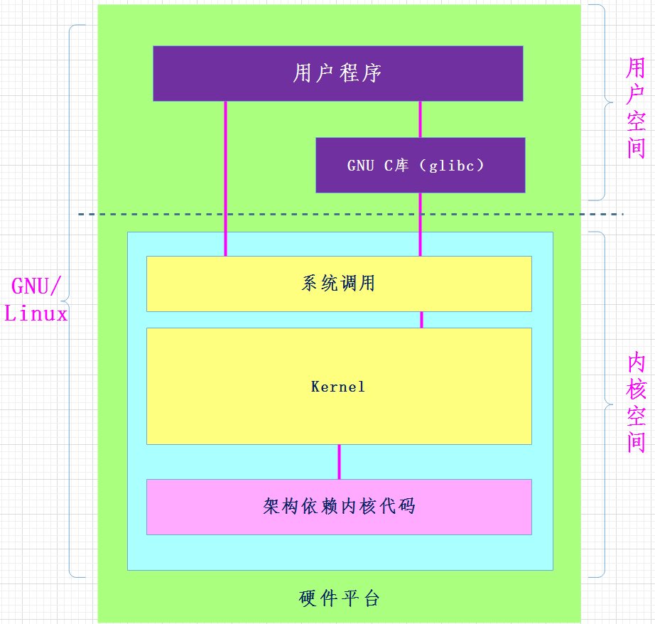

# 操作系统概述

操作系统=对象+API

- [2022 南京大学拔尖计划《操作系统：设计与实现》](https://www.bilibili.com/video/BV1Cm4y1d7Ur?share_source=copy_web)

## POSIX 标准

- [https://pubs.opengroup.org/onlinepubs/9699919799/mindex.html](https://pubs.opengroup.org/onlinepubs/9699919799/mindex.html)

## 操作系统革命

- [【1080P重制】操作系统革命 Revolution OS](https://www.bilibili.com/video/BV1iC4y187nT?share_source=copy_web)

## 泛在操作系统

- [泛在操作系统介绍](./泛在操作系统.md)
